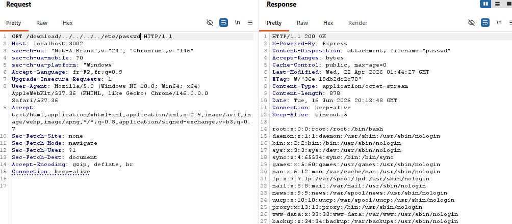
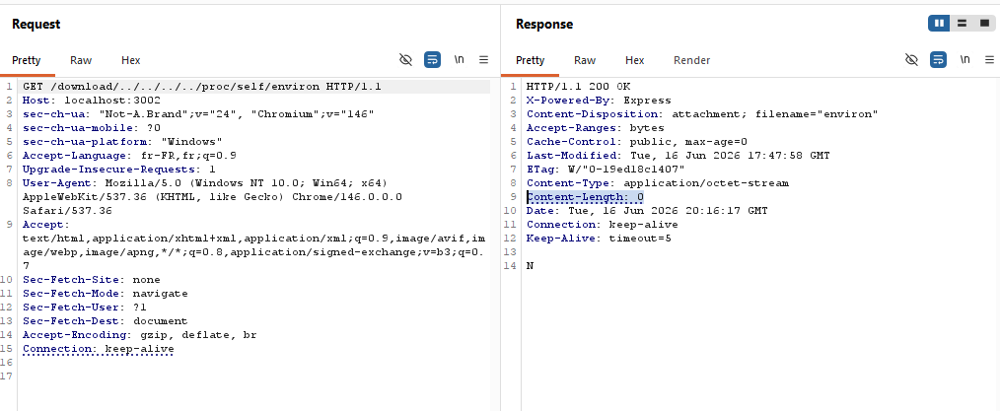
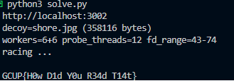

# Gallery

**Category:** Web / LFI + Race Condition  
**Difficulty:** Hard

---
This was one of the 4 Web tasks i wrote for GCUP CTF V2. Overall I had lots of fun writing these challenges and finding out the interesting ways people approached these challenges (or their AI agents did...) and it was also a learning experience seeing the different ways people used to uncover the same vulnerability.

---

Gallery is a wallpaper download site with almost no server code since it levrages https://picsum.photos api. The whole app revolves around one Express file with this interesting code snippet:

```js
app.get(/^\/download\/(.+)/, (req, res) => {
  const name = decodeURIComponent(req.params[0]);
  const p = path.join(DIR, name);
  res.download(p, err => {
    if (err && !res.headersSent) res.status(err.status || 404).end();
  });
});
```

A RegExp route so the capture group keeps slashes. No path normalization or fancy stuff, just a classic LFI where `path.join('/app/gallery', '../../../../etc/hostname')`
resolves to `/etc/hostname`. (～￣▽￣)～



The flag lives only in the `FLAG` environment variable. The natural target is `/proc/self/environ`.
Seems simple enough right? But when you actually try to get the flag, things aren't as they seem.



It returns 200 but nothing. That is the whole challenge.


---

## Why environ is empty

Files under `/proc` are synthetic: the kernel generates their contents on read. They
report `st_size = 0` from `stat()` even though reading them yields real data.

`res.download()` hands off to the [`send`](https://github.com/pillarjs/send) library
(version `1.2.1` here). The path through the code for every file download is:

**1. `sendFile()` calls `fs.stat()` to learn the size**
([`index.js#L627`](https://github.com/pillarjs/send/blob/1.2.1/index.js#L627)):
```javascript
fs.stat(path, function onstat (err, stat) {
  // ...
  self.send(path, stat)
})
```

**2. `send()` sets `Content-Length` from `stat.size`**
([`index.js#L741`](https://github.com/pillarjs/send/blob/1.2.1/index.js#L741),
[`#L805`](https://github.com/pillarjs/send/blob/1.2.1/index.js#L805)):
```javascript
var len = stat.size    // 0 for /proc/self/environ
// ... range parsing ...
res.setHeader('Content-Length', len)
```

**3. `stream()` opens and pipes the file**
([`index.js#L808`](https://github.com/pillarjs/send/blob/1.2.1/index.js#L808)):
```javascript
var stream = fs.createReadStream(path, options)
```

The Content-Length header is committed with 0 between steps 2 and 3. You get the
headers but no body.

The window between step 2 and step 3 is the attack surface: if you can make `stat()`
measure one file and `createReadStream()` open a different one, `send` will stream the
second file's content using the first file's declared length.

This class of vulnerability was first publicly exploited at CTF level in
[SekaiCTF 2024 "Funny LFR"](https://www.justus.pw/writeups/sekai-ctf/funny-lfr.html)
against a Python/Starlette server that had the same stat-then-open split. 
The Node/send version here works on the same principle but uses a different mechanism to flip which file gets opened.

---

## Linux fd reuse

When a process opens a file, Linux assigns the **lowest available** file descriptor
number https://man7.org/linux/man-pages/man5/proc_pid_fd.5.html. 
When that fd closes, the number returns to the pool. 

We can levrage this if we open a file, close it then open a different file hoping the second file lands on the same fd number.

`/proc/self/fd/N` is a symlink that resolves to whatever the process currently has open
on fd N. 
It is live: if node calls .stat on it when N points at a 358 KB JPEG, it gets size 358624.
Stat it a microsecond later when N has been recycled for `/proc/self/environ` and it gets size 0. 
The solve revolves around sending a request to `/download/../../../../proc/self/fd/N` during that
transition and `send` may stat during the JPEG phase (large Content-Length) but open
during the environ phase, giving us environ's content framed with the
JPEG's length.


---

## TOCTOU execution

Three categories of concurrent HTTP requests drive the fd cycling:

1. **Decoy requests.** Repeatedly fetch `shore.jpg` (358 KB) with
   `Range: bytes=0-99` so Node opens and closes the file quickly. This keeps the
   largest available file's fd churning through a predictable descriptor range.

2. **Environ requests.** Repeatedly fetch `/download/../../../../proc/self/environ`
   through the traversal. Node opens environ (stat size 0), gets nothing, closes it.
   This keeps environ cycling through the same descriptor range.

3. **Probe requests.** Fetch `/download/../../../../proc/self/fd/N` for each descriptor
   number in the expected range. The probe sends a massively oversized `Range` header to
   stretch the window between `stat()` and `createReadStream()` inside `send`:

```python
RANGE_HEADER = "bytes=" + ",".join(f"{i * 200}-{i * 200 + 9}" for i in range(1000))
```

That header is just under Node's 16 KB header cap. The window is widened because
`send` does its Range and `If-Range` parsing **between** `Content-Length` being set and
`fs.createReadStream()` being called
([`index.js#L761`](https://github.com/pillarjs/send/blob/1.2.1/index.js#L761),
[`#L767`](https://github.com/pillarjs/send/blob/1.2.1/index.js#L767)):

```javascript
if (this._acceptRanges && BYTES_RANGE_REGEXP.test(ranges)) {
  ranges = parseRange(len, ranges, { combine: true })  // parses all 1000 specs
  if (!this.isRangeFresh()) {   // validates If-Range header
    ranges = -2
  }
  // ...
}
// ... then Content-Length is set, then this.stream() opens the file
```

A malformed `If-Range: "` (a single unclosed double-quote) forces `isRangeFresh()` to
do extra work validating the ETag, buying additional microseconds before the open.

A win looks like: probe stats `/proc/self/fd/N` while N points at `shore.jpg`
(Content-Length = 358624), then opens the same path after N has been recycled for
environ. `send` streams environ's bytes up to 358624 bytes worth; the actual environ
blob is a few KB, but that's enough.

---

## The solver

`solve.py` computes where the file fds will land based on Node's baseline fd count plus
the open connections from each worker pool:

```python
fd_base = 19 + DECOY_WORKERS + ENVIRON_WORKERS + PROBE_THREADS
probe_range = list(range(fd_base, fd_base + 32))
```

It starts all three worker pools, then blocks until any probe thread finds the flag
pattern `GCUP{...}` in a response body:

```python
m = FLAG_RE.search(data)
if m:
    result[0] = m.group(0).decode(errors="replace")
    found.set()
```

The run usually did not surpass a couple of minutes in my tests, but with a messy environment with concurrent requests on the actual server, people's solvers took longer and they had to experiment with different ranges. 
I did expect this and encounter it with testing on remote, but i thought that it would be interesting to leave it as an additional barrier since people had access to AI to help them optimise their solvers ╰(￣ω￣ｏ).



I'm genuinely an enjoyer of tasks that are this simple and get you to dive into the source code for certain libraries since it's a really efficient method to confuse AI models and show the real skill of solvers.
I hope I'm able to find similarly interesting quirks to implement in future tasks.